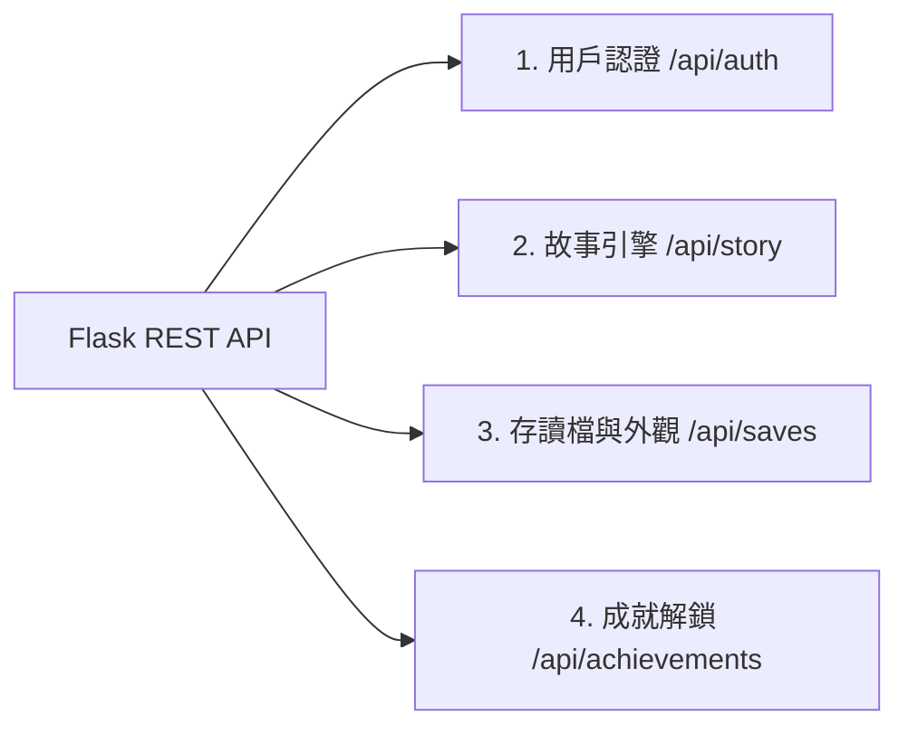

# 戀愛互動式故事網站 - API 路由設計文件 (API Routing Design Specification)

| 專案名稱 | 戀愛互動式故事網站 | 組別 / 組號 | 等一下要吃什麼? / 17 |
| :--- | :--- | :--- | :--- |
| **文件名稱** | API 路由與介面設計規格書 (API Specs) | **主要依據** | [System_Architecture.md](file:///c:/Users/user/OneDrive/%E6%A1%8C%E9%9D%A2/17_What-to-eat--1/docs/System_Architecture.md) & [DB_Design.md](file:///c:/Users/user/OneDrive/%E6%A1%8C%E9%9D%A2/17_What-to-eat--1/docs/DB_Design.md) |
| **文件版本** | V1.0 | **建立日期** | 2026-05-20 |
| **傳輸格式** | JSON (RESTful API) | **身分認證** | Flask Session-based Cookie Auth |

---

## 1. 全域 API 設計規範 (Global Specifications)

1. **基本路徑 (Base URL)**：所有 RESTful API 路由統一以 `/api` 作為前綴。
2. **通訊協定與內容類型**：
   * 請求（Request）與響應（Response）的 `Content-Type` 必須為 `application/json`。
   * 用戶狀態驗證使用 Flask 內建的安全 Session Cookie 進行。
3. **錯誤響應格式 (Error Response Schema)**：
   當 API 執行失敗（如：未登入、驗證不通過、找不到資料），統一回傳 HTTP 狀態碼與如下 JSON：
   ```json
   {
     "status": "error",
     "message": "具體的錯誤說明訊息"
   }
   ```

---

## 2. API 路由清單與細節 (API Endpoints Specification)



### 2.1 用戶認證模組 (F-01 - 侯欣妮)

#### ① 註冊帳號 `POST /api/auth/register`
* **說明**：允許新用戶輸入帳密進行註冊。
* **Request Body**：
  ```json
  {
    "username": "nellie123",
    "password": "securepassword123"
  }
  ```
* **Response (201 Created)**：
  ```json
  {
    "status": "success",
    "message": "註冊成功！",
    "user": {
      "id": 1,
      "username": "nellie123"
    }
  }
  ```

#### ② 登入帳號 `POST /api/auth/login`
* **說明**：驗證密碼，若成功則在伺服器端 Session 寫入 `user_id`。
* **Request Body**：
  ```json
  {
    "username": "nellie123",
    "password": "securepassword123"
  }
  ```
* **Response (200 OK)**：
  ```json
  {
    "status": "success",
    "message": "登入成功！",
    "user": {
      "id": 1,
      "username": "nellie123"
    }
  }
  ```

#### ③ 登出帳號 `POST /api/auth/logout`
* **說明**：清除伺服器端 Session 內的用戶身分。
* **Response (200 OK)**：
  ```json
  {
    "status": "success",
    "message": "已成功登出。"
  }
  ```

#### ④ 查詢目前登入狀態 `GET /api/auth/session`
* **說明**：確認當前 Session 是否有效。
* **Response (200 OK - 已登入)**：
  ```json
  {
    "status": "success",
    "logged_in": true,
    "user": {
      "id": 1,
      "username": "nellie123"
    }
  }
  ```
* **Response (401 Unauthorized - 未登入)**：
  ```json
  {
    "status": "error",
    "logged_in": false,
    "message": "用戶未登入"
  }
  ```

---

### 2.2 核心故事引擎與腳本模組 (F-02 - 林永涵)

#### ① 獲取指定劇本節點 `GET /api/story/nodes/<node_id>`
* **說明**：讀取包含背景圖片、對話框文字、BGM 播放指示、音效與視覺動效在內的完整劇本節點。
* **Response (200 OK)**：
  ```json
  {
    "status": "success",
    "node": {
      "node_id": "scene_02_confess",
      "background_image": "/static/images/bg_cherry_blossom.jpg",
      "speaker": "學長",
      "dialogue": "其實……我已經注意妳很久了。等一下，要不要一起去吃晚餐？",
      "bgm": "/static/audio/bgm/romantic_piano.mp3",
      "effects": [
        { "type": "flash", "color": "rgba(255,182,193,0.4)", "delay": 0 },
        { "type": "sfx", "src": "/static/audio/sfx/wind_bell.mp3", "delay": 200 }
      ],
      "choices": [
        {
          "text": "好啊！我剛好也肚子餓了！",
          "next_node": "scene_03_happy_end",
          "sfx_on_hover": "/static/audio/sfx/bubble_hover.mp3",
          "sfx_on_click": "/static/audio/sfx/select_confirm.mp3"
        }
      ]
    }
  }
  ```

---

### 2.3 存讀檔與外觀配色系統 (F-03: 陳姵羽, F-04: 廖奕臻, F-06: 吳禎晏)

#### ① 獲取當前用戶的所有存檔清單 `GET /api/saves`
* **安全限制**：需登入。
* **Response (200 OK)**：
  ```json
  {
    "status": "success",
    "saves": [
      {
        "id": 12,
        "save_name": "櫻花樹下的抉擇",
        "current_node": "scene_02_confess",
        "custom_player_name": "小晴",
        "ui_theme": "dark-pink",
        "created_at": "2026-05-20T23:30:55+08:00"
      }
    ]
  }
  ```

#### ② 創建/寫入新存檔進度 `POST /api/saves`
* **安全限制**：需登入。
* **Request Body**：
  ```json
  {
    "save_name": "櫻花樹下的抉擇",
    "current_node": "scene_02_confess",
    "custom_player_name": "小晴",
    "ui_theme": "dark-pink",
    "bgm_src": "/static/audio/bgm/romantic_piano.mp3",
    "bgm_position": 42.8,
    "bgm_volume": 0.5,
    "sfx_volume": 0.8,
    "is_muted": false
  }
  ```
* **Response (201 Created)**：
  ```json
  {
    "status": "success",
    "message": "進度保存成功！",
    "save_id": 12
  }
  ```

#### ③ 讀取特定存檔 `GET /api/saves/<int:save_id>`
* **安全限制**：需登入，且存檔必須屬於當前登入用戶。
* **Response (200 OK)**：
  ```json
  {
    "status": "success",
    "save": {
      "id": 12,
      "save_name": "櫻花樹下的抉擇",
      "current_node": "scene_02_confess",
      "custom_player_name": "小晴",
      "ui_theme": "dark-pink",
      "multimedia_state": {
        "bgm_src": "/static/audio/bgm/romantic_piano.mp3",
        "bgm_position": 42.8,
        "bgm_volume": 0.5,
        "sfx_volume": 0.8,
        "is_muted": false
      },
      "created_at": "2026-05-20T23:30:55Z"
    }
  }
  ```

#### ④ 刪除特定存檔 `DELETE /api/saves/<int:save_id>`
* **Response (200 OK)**：
  ```json
  {
    "status": "success",
    "message": "存檔已刪除。"
  }
  ```

---

### 2.4 成就系統模組 (F-05 - 邱柏傑)

#### ① 查詢全成就列表與當前用戶解鎖狀態 `GET /api/achievements`
* **安全限制**：需登入。
* **Response (200 OK)**：
  ```json
  {
    "status": "success",
    "achievements": [
      {
        "id": 1,
        "title": "踏出第一步",
        "description": "首次在劇本做出任何劇情抉擇。",
        "icon_url": "/static/images/achievements/step_one.png",
        "points": 10,
        "unlocked": true,
        "unlocked_at": "2026-05-20T22:15:00Z"
      },
      {
        "id": 2,
        "title": "戀愛大師",
        "description": "達成專案中任一 Happy Ending 結局。",
        "icon_url": "/static/images/achievements/happy_end.png",
        "points": 30,
        "unlocked": false,
        "unlocked_at": null
      }
    ]
  }
  ```

#### ② 解鎖成就 `POST /api/achievements/unlock`
* **說明**：前端故事引擎判定達成某項成就時，向後端發起解鎖請求。
* **安全限制**：需登入。
* **Request Body**：
  ```json
  {
    "achievement_id": 2
  }
  ```
* **Response (200 OK - 成功解鎖)**：
  ```json
  {
    "status": "success",
    "message": "恭喜解鎖成就：戀愛大師！",
    "achievement": {
      "id": 2,
      "title": "戀愛大師",
      "points": 30
    }
  }
  ```
* **Response (200 OK - 已解鎖過)**：
  ```json
  {
    "status": "success",
    "message": "此成就之前已解鎖過。",
    "already_unlocked": true
  }
  ```
