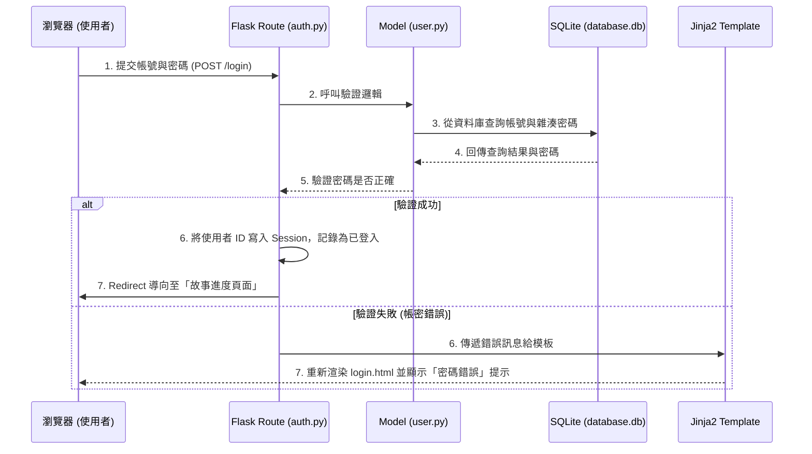

# 系統架構文件 (System Architecture)

**專案名稱**：戀愛互動式故事網站
**功能聚焦**：用戶登入與註冊（F-01）
**日期**：2026-05-14

這份文件說明了「戀愛互動式故事網站」中，為實現「帳號密碼登入、記錄與同步個人故事進度」所設計的技術架構與資料夾結構。

---

## 1. 技術架構說明

為了達成快速開發且容易維護的目標，我們採用以下的技術組合：

- **後端 (Python + Flask)**：Flask 是一個輕量級的 Python 網頁框架。它讓我們可以自己決定資料夾架構，非常適合用來實作「登入、註冊、讀取進度」等後端業務邏輯。
- **模板引擎 (Jinja2)**：不需要複雜的前後端分離架構，直接在後端把資料（如：登入失敗的錯誤訊息、用戶的名稱）塞進 HTML 模板裡，再整包送到使用者的瀏覽器顯示，對初學者來說最直覺。
- **資料庫 (SQLite)**：雖然 PRD 提到 MySQL，但在初期開發與課堂規範下，建議先使用輕量級的 SQLite。不用額外安裝資料庫伺服器，資料會直接存在專案資料夾裡的一個檔案中，負責儲存使用者的帳號、加密密碼與故事進度。

### Flask MVC 模式說明

我們採用 MVC（Model-View-Controller）的設計概念來分工：
- **Model (模型)**：負責跟資料庫打交道。例如：負責把新註冊的帳號密碼寫進資料庫、登入時去資料庫撈密碼來比對、以及更新玩家的故事進度。
- **View (視圖)**：也就是 Jinja2 負責渲染的 HTML 頁面。用來畫出精美的「註冊表單」或「登入畫面」給使用者看。
- **Controller (控制器)**：也就是 Flask 的「路由 (Routes)」。它是中間的橋樑，負責接收使用者送來的表單資料（帳號密碼），接著呼叫 Model 去檢查對不對，最後決定要呼叫 View 顯示成功畫面還是錯誤畫面。

---

## 2. 專案資料夾結構

為了讓程式碼好管理，我們將專案結構劃分如下：

```text
17_What-to-eat-/
├── app/
│   ├── models/
│   │   ├── __init__.py
│   │   └── user.py        ← 【Model】資料庫模型：定義 User 資料表 (包含帳號、密碼、故事進度欄位) 與存取邏輯
│   ├── routes/
│   │   ├── __init__.py
│   │   └── auth.py        ← 【Controller】Flask 路由：處理 /login, /register, /logout 的邏輯
│   ├── templates/         ← 【View】Jinja2 HTML 模板：負責畫面呈現
│   │   ├── base.html      ← 共同的頁面版型 (包含網站導覽列、載入 CSS/JS)
│   │   ├── login.html     ← 登入表單頁面
│   │   └── register.html  ← 註冊表單頁面
│   └── static/            ← 靜態資源
│       ├── css/
│       │   └── style.css  ← 登入與註冊頁面的排版與外觀樣式
│       └── js/
│           └── main.js    ← 基礎表單驗證等前端互動邏輯
├── instance/
│   └── database.db        ← SQLite 資料庫檔案 (儲存所有用戶資料的地方)
├── docs/
│   ├── PRD_戀愛互動式故事網站.md ← 產品需求文件
│   └── ARCHITECTURE.md    ← 系統架構文件 (本文件)
└── app.py                 ← Flask 程式進入點：負責啟動伺服器、初始化資料庫與註冊路由
```

---

## 3. 元件關係圖

以下圖解說明當使用者嘗試登入時，系統內部元件是如何互動的：



---

## 4. 關鍵設計決策

1. **使用 Session 保持登入狀態**  
   登入成功後，我們會將用戶的 ID 存在 Flask 內建的 `session` 裡（會存放在使用者的瀏覽器 Cookie 中並加密）。之後使用者在看故事、存檔時，系統只要檢查 Session 就能知道是哪位用戶，確保每個人只能讀取/同步自己的故事進度。

2. **密碼雜湊 (Hash) 加密儲存**  
   為了保護使用者安全，**絕對不可以直接在資料庫儲存明文密碼**。我們會在寫入資料庫前，使用 `werkzeug.security` 的 `generate_password_hash` 把密碼打亂成亂碼儲存；登入時再使用 `check_password_hash` 來驗證。這樣即使資料庫外洩，駭客也看不到真實密碼。

3. **統一管理進度同步與登入邏輯**  
   為了避免程式碼雜亂，我們將用戶的「註冊」、「密碼驗證」及「故事進度更新」這三大功能，全部封裝在 `app/models/user.py` 這個模型中。這樣在路由 `auth.py` 裡只需要呼叫簡單的函式（如：`User.login(username, password)`），保持 Controller 乾淨易讀，符合「高內聚、低耦合」的好習慣。
