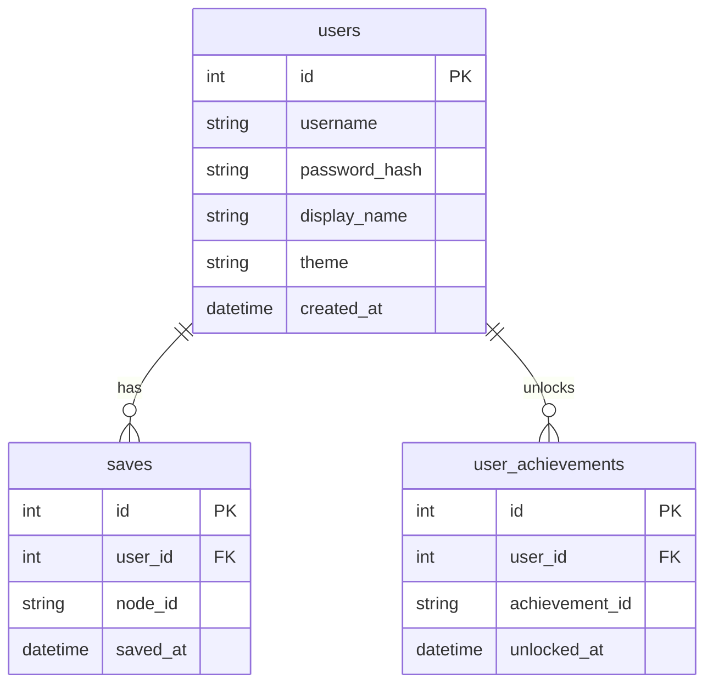

# 資料庫設計文件 (DB Design)

**專案名稱**：戀愛互動式故事網站
**日期**：2026-05-14

本文件依據 PRD 與流程圖設計，定義 SQLite 資料庫的結構、關聯與建表語法。

## 1. ER 圖（實體關係圖）

## 2. 資料表詳細說明

### 2.1 `users` (使用者表)
儲存使用者的基本帳號資料與個人化設定 (F-01, F-04)。
- `id`: INTEGER, Primary Key, 自動遞增。
- `username`: TEXT, 必填, 唯一（登入帳號）。
- `password_hash`: TEXT, 必填（雜湊後的密碼）。
- `display_name`: TEXT, 預設為空（自定義角色名稱）。
- `theme`: TEXT, 預設為 'light'（介面佈景主題）。
- `created_at`: DATETIME, 帳號建立時間。

### 2.2 `saves` (存檔表)
記錄玩家在故事中的進度點位 (F-03)。
- `id`: INTEGER, Primary Key, 自動遞增。
- `user_id`: INTEGER, Foreign Key (對應 `users.id`), 必填。
- `node_id`: TEXT, 必填（當前劇情節點 ID）。
- `saved_at`: DATETIME, 存檔時間。

### 2.3 `user_achievements` (成就紀錄表)
記錄玩家達成的特定結局或隱藏成就 (F-05)。
- `id`: INTEGER, Primary Key, 自動遞增。
- `user_id`: INTEGER, Foreign Key (對應 `users.id`), 必填。
- `achievement_id`: TEXT, 必填（成就的唯一代碼）。
- `unlocked_at`: DATETIME, 解鎖時間。
