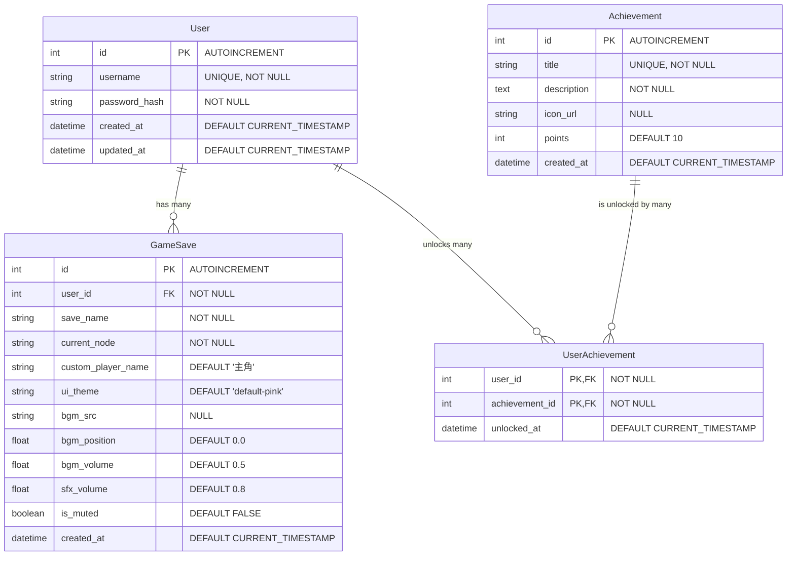

# 戀愛互動式故事網站 - 資料庫設計文件 (Database Design Specification)

| 專案名稱 | 戀愛互動式故事網站 | 組別 / 組號 | 等一下要吃什麼? / 17 |
| :--- | :--- | :--- | :--- |
| **文件名稱** | 資料庫設計與模型規格書 (DB Design & Model Spec) | **主要依據** | 專案功能需求表 F-01 ~ F-06 |
| **文件版本** | V1.0 | **建立日期** | 2026-05-20 |
| **資料庫技術** | SQLite (前後端整合統一規範) | **後端 ORM** | Flask-SQLAlchemy (Python) |

---

## 1. 實體關係圖 (Entity Relationship Diagram - ERD)

本系統包含用戶管理（F-01）、存讀檔（F-03）、外觀設置（F-04）、成就系統（F-05）與多媒體狀態（F-06）。為了實現資料的關聯性與完整性，設計如下的實體關係模型：



---

## 2. 資料表詳細欄位設計 (Schema Specification)

### 2.1 `users` 資料表 (用戶帳號表 - F-01)
* **用途**：記錄使用者的註冊帳號與加密後的密碼雜湊，確保安全登入。
* **實體表名**：`users`

| 欄位名稱 | 資料類型 | 鍵/約束 | 預設值 | 說明 |
| :--- | :--- | :--- | :--- | :--- |
| `id` | INTEGER | PRIMARY KEY, AUTOINCREMENT | | 用戶唯一識別碼 |
| `username` | VARCHAR(80) | UNIQUE, NOT NULL | | 登入帳號（不重複） |
| `password_hash` | VARCHAR(128) | NOT NULL | | 加密密碼雜湊（PBKDF2 / Bcrypt） |
| `created_at` | DATETIME | NOT NULL | CURRENT_TIMESTAMP | 帳號創立時間 |
| `updated_at` | DATETIME | NOT NULL | CURRENT_TIMESTAMP | 帳號最後更新時間 |

---

### 2.2 `game_saves` 資料表 (存檔資料表 - F-03, F-04, F-06)
* **用途**：保存玩家故事進度、外觀客製化數值以及多媒體播放狀態。
* **實體表名**：`game_saves`

| 欄位名稱 | 資料類型 | 鍵/約束 | 預設值 | 說明 |
| :--- | :--- | :--- | :--- | :--- |
| `id` | INTEGER | PRIMARY KEY, AUTOINCREMENT | | 存檔唯一識別碼 |
| `user_id` | INTEGER | FOREIGN KEY (users.id), NOT NULL | | 關聯的用戶識別碼，級聯刪除 |
| `save_name` | VARCHAR(100) | NOT NULL | | 玩家自訂的存檔名稱（如：櫻花樹下） |
| `current_node` | VARCHAR(100) | NOT NULL | | 故事引擎目前所在的節點 ID |
| `custom_player_name` | VARCHAR(80) | NOT NULL | '主角' | F-04: 玩家自訂的角色暱稱 |
| `ui_theme` | VARCHAR(50) | NOT NULL | 'default-pink' | F-04: 介面配置主題樣式名稱 |
| `bgm_src` | VARCHAR(200) | | NULL | F-06: 存檔時正在播放的 BGM 路徑 |
| `bgm_position` | FLOAT | NOT NULL | 0.0 | F-06: BGM 暫停時的播放時間點 (秒) |
| `bgm_volume` | FLOAT | NOT NULL | 0.5 | F-06: 用戶背景音樂音量大小 |
| `sfx_volume` | FLOAT | NOT NULL | 0.8 | F-06: 用戶情境音效音量大小 |
| `is_muted` | BOOLEAN | NOT NULL | FALSE (0) | F-06: 是否處於一鍵靜音狀態 |
| `created_at` | DATETIME | NOT NULL | CURRENT_TIMESTAMP | 存檔建立時間 |

---

### 2.3 `achievements` 資料表 (成就主檔表 - F-05)
* **用途**：記錄遊戲中所有可被解鎖的成就項目（靜態資料）。
* **實體表名**：`achievements`

| 欄位名稱 | 資料類型 | 鍵/約束 | 預設值 | 說明 |
| :--- | :--- | :--- | :--- | :--- |
| `id` | INTEGER | PRIMARY KEY, AUTOINCREMENT | | 成就唯一識別碼 |
| `title` | VARCHAR(100) | UNIQUE, NOT NULL | | 成就名稱（如：初戀的滋味） |
| `description` | TEXT | NOT NULL | | 成就達成條件詳細描述 |
| `icon_url` | VARCHAR(200) | | NULL | 成就徽章圖片路徑 |
| `points` | INTEGER | NOT NULL | 10 | 成就積分分數 |
| `created_at` | DATETIME | NOT NULL | CURRENT_TIMESTAMP | 建立時間 |

---

### 2.4 `user_achievements` 資料表 (用戶成就關係表 - F-05 橋接表)
* **用途**：記錄哪些用戶解鎖了哪些成就以及解鎖的時間（多對多關係）。
* **實體表名**：`user_achievements`

| 欄位名稱 | 資料類型 | 鍵/約束 | 預設值 | 說明 |
| :--- | :--- | :--- | :--- | :--- |
| `user_id` | INTEGER | PRIMARY KEY, FOREIGN KEY (users.id) | | 關聯的用戶識別碼 |
| `achievement_id`| INTEGER | PRIMARY KEY, FOREIGN KEY (achievements.id)| | 關聯的成就識別碼 |
| `unlocked_at` | DATETIME | NOT NULL | CURRENT_TIMESTAMP | 成就解鎖時間點 |

---

## 3. 資料庫索引設計 (Database Indexes)

為了優化查詢效能，特別是在大量玩家進行進度查詢或排行讀取時，在 SQLite 中規劃如下索引：

1. **`idx_saves_user`**：建立於 `game_saves(user_id)`。
   * *優化場景*：玩家打開「存檔清單」時，快速檢索該玩家底下的所有歷史存檔。
2. **`idx_user_achievements_user`**：建立於 `user_achievements(user_id)`。
   * *優化場景*：玩家打開「成就牆」時，快速查出該用戶已解鎖的成就清單。

---

## 4. 預設種子資料設計 (Default Database Seeds)

在成就系統（F-05）初始化時，需預先寫入以下基礎成就資料至 `achievements` 表中：

```sql
INSERT INTO achievements (title, description, icon_url, points) VALUES
('踏出第一步', '首次在劇本做出任何劇情抉擇。', '/static/images/achievements/step_one.png', 10),
('戀愛大師', '達成專案中任一 Happy Ending 結局。', '/static/images/achievements/happy_end.png', 30),
('遺憾的美好', '達成第一個 Sad Ending 結局。', '/static/images/achievements/sad_end.png', 20),
('音律沉浸者', '在設定中調整過音量或靜音開關。', '/static/images/achievements/music_lover.png', 10),
('百變主角', '自訂角色暱稱並更換介面主題。', '/static/images/achievements/custom_hero.png', 15);
```

---

## 5. 後端技術整合建議 (Flask Integration Integration)

1. **Flask-SQLAlchemy 配置**：
   在後端 `app/__init__.py` 中，初始化資料庫連接：
   ```python
   from flask import Flask
   from flask_sqlalchemy import SQLAlchemy

   db = SQLAlchemy()

   def create_app():
       app = Flask(__name__)
       app.config['SQLALCHEMY_DATABASE_URI'] = 'sqlite:///database/story.db'
       app.config['SQLALCHEMY_TRACK_MODIFICATIONS'] = False
       db.init_app(app)
       return app
   ```
2. **密碼安全性**：
   `User` 模型內建 `generate_password_hash` 與 `check_password_hash` 封裝，保證密碼不在資料庫中明文儲存，嚴防資安漏洞。
3. **JSON 序列化 (Serialization)**：
   所有模型均內建 `to_dict()` 介面，方便 Flask Controller 在撰寫 REST API 路由時，能直接調用並回傳給前端 Fetch API 進行渲染。
