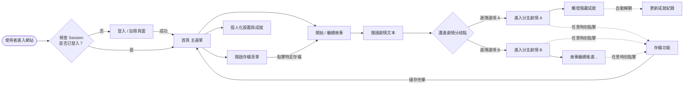
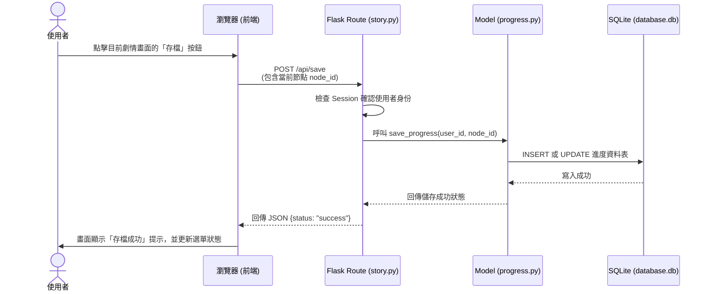

# 流程圖文件 (Flowchart)

**專案名稱**：戀愛互動式故事網站
**日期**：2026-05-14

本文件根據 `PRD_戀愛互動式故事網站.md` 與 `docs/ARCHITECTURE.md` 的規劃產出，包含使用者操作路徑、系統資料流以及功能對照表，藉此視覺化系統的運作方式。

---

## 1. 使用者流程圖（User Flow）

此流程圖描述使用者從進入網站開始，一直到遊玩故事、遭遇選項分歧、進行存檔與查看成就的完整操作路徑。

---

## 2. 系統序列圖（Sequence Diagram）

此序列圖描述了核心功能：「使用者在故事中推進進度並點擊存檔」時，前後端與資料庫的完整資料流。

---

## 3. 功能清單對照表

下表彙整了 PRD 功能清單對應的 URL 路由規劃與 HTTP 方法，供後續 Flask 實作時對照使用：

| 功能編號 | 功能名稱 | URL 路徑 | HTTP 方法 | 路由職責說明 |
| :--- | :--- | :--- | :--- | :--- |
| **F-01** | 用戶註冊 | `/register` | GET / POST | GET: 顯示註冊表單。 POST: 處理註冊資料寫入資料庫。 |
| **F-01** | 用戶登入 | `/login` | GET / POST | GET: 顯示登入表單。 POST: 驗證帳密並寫入 Session。 |
| **F-01** | 用戶登出 | `/logout` | GET | 清除 Session 並導回登入頁。 |
| **F-02** | 網站首頁 | `/` 或 `/home` | GET | 登入後顯示的主選單，包含開始遊戲、讀取存檔等入口。 |
| **F-02** | 閱讀故事 | `/story/<node_id>` | GET | 根據 `node_id` 從資料庫撈取劇情文本與選項，並渲染畫面。 |
| **F-03** | 存檔清單 | `/saves` | GET | 取得並顯示該使用者擁有的所有歷史存檔紀錄。 |
| **F-03** | 儲存進度 | `/api/save` | POST | 接收前端傳來的劇情節點 ID 並寫入資料庫。 |
| **F-04** | 個人化設置 | `/settings` | GET / POST | 讓玩家修改角色名稱、切換背景音樂或佈景主題設定。 |
| **F-05** | 成就系統 | `/achievements` | GET | 顯示玩家目前的成就解鎖進度與隱藏項目。 |
