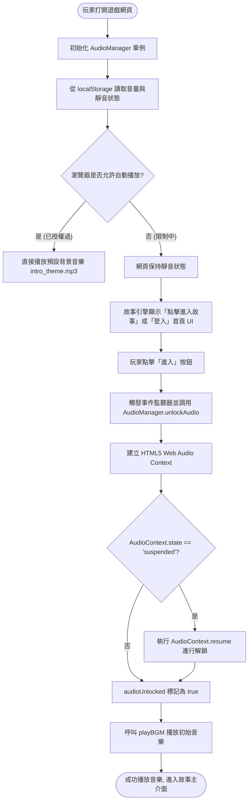
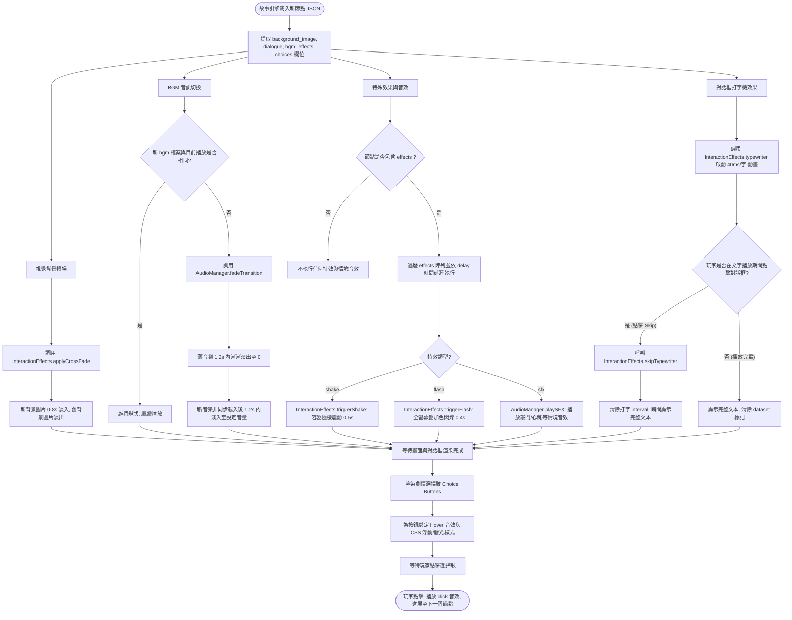
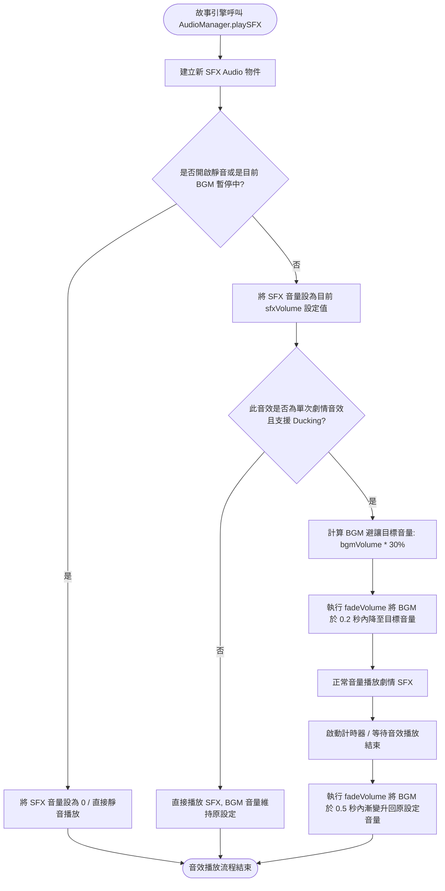

# 戀愛互動式故事網站 - 多媒體與互動流程圖 (System Flowcharts)

| 專案名稱 | 戀愛互動式故事網站 | 組別 / 組號 | 等一下要吃什麼? / 17 |
| :--- | :--- | :--- | :--- |
| **文件名稱** | 多媒體與互動流程圖 (Multimedia Flowcharts) | **主要依據** | [PRD_Multimedia_Interaction.md](file:///c:/Users/user/OneDrive/%E6%A1%8C%E9%9D%A2/17_What-to-eat--1/docs/PRD_Multimedia_Interaction.md) & [System_Architecture.md](file:///c:/Users/user/OneDrive/%E6%A1%8C%E9%9D%A2/17_What-to-eat--1/docs/System_Architecture.md) |
| **文件版本** | V1.0 | **建立日期** | 2026-05-20 |
| **狀態** | 正式 (Finalized) | **適用範圍** | 前端開發、音訊管理與動效控制邏輯實作 |

---

## 1. 流程圖一：全域初始化與瀏覽器自動播放解鎖流程

本流程描述網頁首次載入時，多媒體互動模組如何偵測瀏覽器的 Autoplay 政策限制，並透過使用者互動解鎖音訊上下文，確保背景音樂（BGM）順利播放。

---

## 2. 流程圖二：核心劇本節點渲染與多媒體執行流程

當故事引擎（F-02）載入新劇本節點時，此流程控制多媒體互動模組（BGM 切換、特效渲染、打字機效果）與玩家互動的並行執行邏輯。

---

## 3. 流程圖三：音訊避讓 (Audio Ducking) 控制流程

當觸發重要劇情音效（如巨大的敲門聲、爆炸聲、受傷心跳聲）時，系統會自動調降 BGM 音量以避免雜音干擾並強化氛圍，音效播放完畢後再恢復 BGM 音量。

---

## 4. 流程圖四：存讀檔多媒體狀態同步流程

當玩家執行存檔（Save）或讀檔（Load）時，前後端資料庫與多媒體控制器的同步處理流程。

```mermaid
flowchart TD
    subgraph SAVE_FLOW [存檔流程]
        S1([玩家點擊存檔]) --> S2[取得當前故事引擎節點 node_id]
        S2 --> S3[讀取 AudioManager 全域狀態]
        S3 --> S4[封裝 multimedia_state:<br/>BGM 路徑、播放進度 currentTime、音量值、靜音狀態]
        S4 --> S5[透過 Fetch POST 傳送 JSON 資料至 Flask 後端]
        S5 --> S6[Flask 執行 SQL 將多媒體與存檔狀態寫入 SQLite]
        S6 --> S7([顯示「存檔成功」提示])
    end

    subgraph LOAD_FLOW [讀檔流程]
        L1([玩家點擊讀檔]) --> L2[選擇存檔點, 發送 GET 請求]
        L2 --> L3[Flask 從 SQLite 讀取 JSON 並回傳前端]
        L3 --> L4[故事引擎 F-02 還原當前劇情節點場景]
        L4 --> L5[讀取 JSON 中的 multimedia_state]
        
        L5 --> L6[設定音量滑桿數值與靜音狀態至 AudioManager]
        L6 --> L7{存檔中的 BGM 與目前播放是否相同?}
        
        L7 -- 否 --> L8[調用 playBGM 載入新背景音樂]
        L7 -- 是 --> L9[繼續播放現有背景音樂]
        
        L8 --> L10[將背景音樂播放進度設為 saved currentTime]
        L9 --> L10
        L10 --> L11([恢復打字機文字顯示，玩家繼續遊玩])
    end
```

---

*備註：以上流程圖明確規定了多媒體管理（F-06）在執行時的條件分支、計時器延遲與資料庫交互時機，開發人員（吳禎晏）需依此邏輯編寫 JavaScript 邏輯結構，以符合專案架構規範。*
