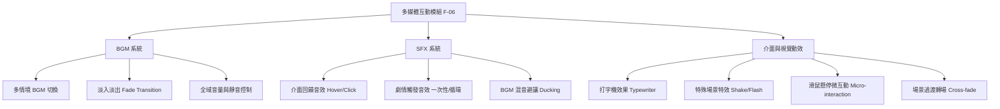

# 戀愛互動式故事網站 - 多媒體互動模組 (F-06) 產品需求文件 (PRD)

| 專案名稱 | 戀愛互動式故事網站 | 組別 / 組號 | 等一下要吃什麼? / 17 |
| :--- | :--- | :--- | :--- |
| **模組名稱** | 多媒體互動模組 (F-06) | **負責人** | 吳禎晏 |
| **文件版本** | V1.0 | **建立日期** | 2026-05-20 |
| **對應功能** | 背景音樂、音效播放與介面互動回饋效果 | **狀態** | 草案 (Draft) |

---

## 1. 專案背景與目標 (Background & Objectives)

本專案旨在打造一個由讀者驅動的「戀愛互動式故事網站」。為了克服傳統電子書或純文字小說單調、缺乏沉浸感的痛點，**多媒體互動模組 (F-06)** 扮演了至關重要的角色。

本模組的核心目標為：
1. **提升情感沉浸感**：藉由符合劇情氛圍的背景音樂 (BGM)，引導使用者的情緒起伏（如浪漫、緊張、哀傷、歡樂）。
2. **強化互動即時回饋**：透過精緻的音效 (SFX) 與 UI 視覺微動效（如打字機效果、按鈕懸停與點擊動效、螢幕震動與閃爍），給予使用者即時且深刻的遊玩反饋。
3. **保證流暢與相容性**：在純 JavaScript 且不使用大型前端框架的課堂規範下，實現輕量且高效的音訊與動畫管理，並克服瀏覽器自動播放限制 (Autoplay Policy)。

---

## 2. 目標使用者與使用情境 (User Personas & Scenarios)

### 2.1 使用情境 A：浪漫告白情節
* **劇情**：男女主角在雨後的櫻花樹下相遇，男主角向女主角表白。
* **多媒體回饋**：
  - 音樂從安靜無聲漸漸淡入 (Fade-in) 輕柔浪漫的鋼琴 BGM。
  - 畫面上女主角的對話文字以「打字機效果」緩緩出現，字體微幅晃動展現緊張感。
  - 當玩家將滑鼠懸停於選擇肢「接受他的告白」時，按鈕產生柔和的粉色呼吸光暈並發出微弱的暖色風鈴音效。
  - 點擊選項後，畫面淡入櫻花飄落的動畫（轉場），背景音樂無縫過渡到更歡快的戀愛主題。

### 2.2 使用情境 B：突發危機情節
* **劇情**：主角在深夜接到一通神祕電話，隨後門外傳來急促的敲門聲。
* **多媒體回饋**：
  - 音樂切換為低沉緊張的弦樂。
  - 突然響起「敲門聲」音效 (SFX)，此時 BGM 自動略微降低音量 (Audio Ducking) 以凸顯敲門聲。
  - 敲門聲響起的瞬間，整個遊戲畫面產生微幅「震動效果 (Screen Shake)」，並伴隨一次短暫的紅光閃爍，帶給玩家心理震懾。

---

## 3. 功能需求規格 (Functional Requirements)

本模組主要分為三大支柱：**背景音樂 (BGM) 系統**、**情境音效 (SFX) 系統**、**介面互動回饋與視覺動效**。



### 3.1 背景音樂 (BGM) 系統

| 需求編號 | 功能名稱 | 詳細需求描述 | 優先級 |
| :--- | :--- | :--- | :--- |
| **F-06-B1** | BGM 循環播放 | 所有背景音樂皆需設定為自動循環播放 (`loop = true`)，確保故事閱讀期間音樂不中斷。 | P0 |
| **F-06-B2** | BGM 情境切換與淡入淡出 | 當劇情走向改變需要切換 BGM 時，舊音樂需在 **1.0 ~ 1.5 秒內淡出 (Fade-out)** 至靜音，新音樂則在 **1.0 ~ 1.5 秒內淡入 (Fade-in)**。避免直接切斷造成的突兀感。 | P0 |
| **F-06-B3** | 音量控制與靜音開關 | 介面右上角需提供全域「音量調節滑桿 (Slider)」與「一鍵靜音/解靜音 (Mute Toggle)」按鈕。系統需使用 `localStorage` 記錄使用者的音量設定，確保跨頁面或重新整理後設定不遺失。 | P0 |
| **F-06-B4** | 瀏覽器 Autoplay 解鎖機制 | 由於現代瀏覽器安全限制，未經互動無法播放音訊。系統必須在「開始遊戲」或「登入」的第一個點擊事件中，初始化並解鎖 Audio Context。 | P0 |
| **F-06-B5** | 音軌預載機制 | 在切換劇本段落時，非當前播放但可能在下一分支觸發的 BGM 應進行非同步預載 (`preload="auto"`)，保證載入小於 2 秒之效能需求。 | P1 |

### 3.2 情境音效 (SFX) 系統

| 需求編號 | 功能名稱 | 詳細需求描述 | 優先級 |
| :--- | :--- | :--- | :--- |
| **F-06-S1** | 介面回饋音效 | 提供輕量化、短促（< 0.5 秒）的音效：<br>1. **Hover 音效**：滑鼠移入劇情選擇肢或關鍵按鈕時播放（清脆微弱）。<br>2. **Click 音效**：點擊確認、切換選單或做出決定時播放（有回饋感）。 | P0 |
| **F-06-S2** | 劇情觸發音效 | 支援單次播放（如開門聲、電話響）與持續循環播放（如雨聲、心跳聲，需提供暫停介面），由核心故事引擎經由劇本腳本（Script）事件觸發。 | P0 |
| **F-06-S3** | 音訊避讓機制 (Ducking) | 當播放重要劇情音效（如大聲的爆炸、敲門或角色心跳聲）時，背景音樂 (BGM) 的音量需**在 0.2 秒內自動降低至原本的 30%**，並在音效播放完畢後，**在 0.5 秒內漸變回復**原本音量，以凸顯音效張力。 | P1 |
| **F-06-S4** | 多重音效併發支援 | 系統需支援同時播放多個不同的音效（例如：在「雨聲」持續循環的背景下，重疊播放「敲門聲」與按鈕「點擊聲」），不可互相覆蓋。 | P0 |

### 3.3 介面互動回饋與視覺動效 (UI/UX Feedback)

| 需求編號 | 功能名稱 | 詳細需求描述 | 優先級 |
| :--- | :--- | :--- | :--- |
| **F-06-I1** | 文字打字機效果 (Typewriter) | 故事對話框文字以「逐字顯示」呈現，預設速度為 **每字 40ms ~ 60ms**。<br>- **快速跳過**：當玩家點擊對話框任意處時，立即終止打字動畫，並直接顯示該段的全部文字。 | P0 |
| **F-06-I2** | 畫面震動與閃爍特效 (Shake/Flash) | 為了配合驚嚇、緊張或心跳音效，提供兩種 CSS 動效類別：<br>- `effect-shake`：容器或全螢幕產生隨機 X/Y 軸快速位移（持續約 0.5 秒）。<br>- `effect-flash`：全螢幕疊加層產生紅/白色的不透明度瞬時閃爍（持續約 0.2 ~ 0.5 秒）。 | P1 |
| **F-06-I3** | 選擇肢動態登場與 Hover 互動 | 劇情分支選項卡片（Choices）登場時，採用自下方或側面**平滑淡入滑出 (Slide & Fade in)**。<br>懸停 (Hover) 時，卡片需有 3D 浮起感 (`transform: translateY(-4px) scale(1.02)`)，搭配柔和外發光 (Box-shadow transition) 與漸變色切換。 | P0 |
| **F-06-I4** | 場景過渡與背景圖轉場 | 更換故事背景圖時，採用 **Cross-fade (交叉淡入淡出)** 轉場，新舊圖重疊淡入時間為 **0.8 秒**，確保視覺過渡平滑，不出現白畫面。 | P0 |

---

## 4. 非功能性需求與限制 (Non-functional Requirements)

1. **效能要求 (Performance)**：
   - 音訊檔案需進行壓縮處理（BGM 採用 MP3 格式，位元率 128kbps 為佳；短音效採用 WAV 或高壓縮率 MP3/OGG）。
   - 轉場動畫與新場景多媒體資源的**總體載入時間應小於 2 秒**（符合整體需求 2.2 效能指標）。
2. **純前端限制 (Framework-less Constraint)**：
   - 僅使用原生 HTML5 Audio API 與 Vanilla JavaScript (ES6+)。
   - 不得依賴第三方音訊庫（如 Howler.js），確保程式碼輕量化且符合課程規範。
3. **無縫整合性 (Integration)**：
   - 必須提供低耦合的 API 介面，便於與 **林永涵 (F-02 核心故事引擎)** 的劇本 JSON 結構整合，以及與 **廖奕臻 (F-04 個人化外觀設置)** 的配色系統協調。
4. **外觀一致性 (Aesthetics & Theme)**：
   - 所有視覺反饋（如選擇肢按鈕的 Hover 光暈、閃爍特效）必須採用符合「戀愛主題」的粉嫩、和諧、微透明玻璃擬態 (Glassmorphism) 色系，嚴格避免刺眼的純紅、純藍。

---

## 5. 系統架構與 API 設計 (System Architecture & API Design)

為了讓負責「多媒體互動模組 (F-06)」的吳禎晏能與負責「故事引擎 (F-02)」的林永涵進行無縫協作，設計一組高內聚、低耦合的 JavaScript class。

### 5.1 音訊管理器 (AudioManager) 設計

```javascript
class AudioManager {
  constructor() {
    this.bgmVolume = parseFloat(localStorage.getItem('bgmVolume')) || 0.5;
    this.sfxVolume = parseFloat(localStorage.getItem('sfxVolume')) || 0.8;
    this.isMuted = localStorage.getItem('isMuted') === 'true';
    
    this.currentBGM = null; // 當前的 Audio 物件
    this.activeSFXs = new Set(); // 正在播放的 SFX Audio 物件集合
    this.audioUnlocked = false;
  }

  /**
   * 解鎖瀏覽器 Autoplay 限制 (由首個點擊事件觸發)
   */
  unlockAudio() {
    if (this.audioUnlocked) return;
    // 建立一個短音訊以解鎖
    const context = new (window.AudioContext || window.webkitAudioContext)();
    if (context.state === 'suspended') {
      context.resume();
    }
    this.audioUnlocked = true;
    console.log("Audio Context Unlocked");
  }

  /**
   * 播放或切換背景音樂 (支援淡入淡出)
   * @param {string} src 音源路徑
   */
  playBGM(src) {
    if (!this.audioUnlocked) this.unlockAudio();
    
    // 如果是同一首，則繼續播放
    if (this.currentBGM && this.currentBGM.src.endsWith(src)) {
      if (this.currentBGM.paused) this.currentBGM.play();
      return;
    }

    const newBGM = new Audio(src);
    newBGM.loop = true;
    newBGM.volume = 0; // 從靜音開始淡入

    if (this.currentBGM) {
      // 舊 BGM 淡出，新 BGM 淡入
      this.fadeTransition(this.currentBGM, newBGM);
    } else {
      this.currentBGM = newBGM;
      if (!this.isMuted) {
        newBGM.play().catch(err => console.log("Playback blocked:", err));
        this.fadeVolume(newBGM, 0, this.bgmVolume, 1000); // 1秒淡入
      }
    }
  }

  /**
   * 播放情境音效
   * @param {string} src 音源路徑
   * @param {boolean} loop 是否循環 (預設為 false)
   */
  playSFX(src, loop = false) {
    if (!this.audioUnlocked) this.unlockAudio();

    const sfx = new Audio(src);
    sfx.loop = loop;
    sfx.volume = this.isMuted ? 0 : this.sfxVolume;

    // 觸發音訊避讓 (Ducking)
    if (!loop && !this.isMuted) {
      this.applyAudioDucking();
    }

    sfx.play().catch(err => console.log("SFX blocked:", err));
    this.activeSFXs.add(sfx);

    sfx.onended = () => {
      this.activeSFXs.delete(sfx);
    };

    return sfx; // 回傳以供後續暫停或控制
  }

  /**
   * 音訊避讓 (Ducking) 實作
   */
  applyAudioDucking() {
    if (!this.currentBGM || this.isMuted) return;
    const targetVolume = this.bgmVolume * 0.3; // 降至 30%
    const originalVolume = this.bgmVolume;

    // 0.2秒快速淡出降音量
    this.fadeVolume(this.currentBGM, this.currentBGM.volume, targetVolume, 200);

    // 假設普通音效在 1.5 秒後結束，之後 0.5 秒淡回原音量
    setTimeout(() => {
      if (this.currentBGM) {
        this.fadeVolume(this.currentBGM, this.currentBGM.volume, originalVolume, 500);
      }
    }, 1500);
  }

  /**
   * 漸變調整音量輔助函式
   */
  fadeVolume(audio, start, end, duration) {
    const steps = 20;
    const stepTime = duration / steps;
    const volumeStep = (end - start) / steps;
    let currentStep = 0;

    const interval = setInterval(() => {
      currentStep++;
      let nextVolume = start + (volumeStep * currentStep);
      // 邊界防禦
      nextVolume = Math.max(0, Math.min(1, nextVolume));
      audio.volume = nextVolume;

      if (currentStep >= steps) {
        clearInterval(interval);
        audio.volume = end;
      }
    }, stepTime);
  }

  /**
   * 淡入淡出轉場
   */
  fadeTransition(oldAudio, newAudio) {
    const fadeOutDuration = 1200; // 1.2 秒
    
    // 舊音軌淡出並暫停
    this.fadeVolume(oldAudio, oldAudio.volume, 0, fadeOutDuration);
    setTimeout(() => {
      oldAudio.pause();
      this.currentBGM = newAudio;
      
      // 新音軌淡入
      if (!this.isMuted) {
        newAudio.play().catch(err => console.log(err));
        this.fadeVolume(newAudio, 0, this.bgmVolume, fadeOutDuration);
      }
    }, fadeOutDuration);
  }

  /**
   * 全域音量控制
   */
  setBGMVolume(val) {
    this.bgmVolume = val;
    localStorage.setItem('bgmVolume', val);
    if (this.currentBGM && !this.isMuted) {
      this.currentBGM.volume = val;
    }
  }

  setSFXVolume(val) {
    this.sfxVolume = val;
    localStorage.setItem('sfxVolume', val);
    this.activeSFXs.forEach(sfx => {
      sfx.volume = val;
    });
  }

  toggleMute() {
    this.isMuted = !this.isMuted;
    localStorage.setItem('isMuted', this.isMuted);
    
    if (this.isMuted) {
      if (this.currentBGM) this.currentBGM.volume = 0;
      this.activeSFXs.forEach(sfx => sfx.volume = 0);
    } else {
      if (this.currentBGM) this.currentBGM.volume = this.bgmVolume;
      this.activeSFXs.forEach(sfx => sfx.volume = this.sfxVolume);
    }
    return this.isMuted;
  }
}
```

### 5.2 互動視覺特效管理器 (InteractionEffects) 設計

```javascript
class InteractionEffects {
  /**
   * 逐字顯示打字機效果
   * @param {HTMLElement} element 目標 HTML 容器
   * @param {string} text 要顯示的完整文字
   * @param {number} speed 速度 (ms/字)
   * @param {Function} callback 完成後的 callback
   */
  static typewriter(element, text, speed = 50, callback = null) {
    element.textContent = "";
    let index = 0;
    
    // 清除舊的打字排程
    if (element.dataset.typewriterInterval) {
      clearInterval(parseInt(element.dataset.typewriterInterval));
    }

    const interval = setInterval(() => {
      element.textContent += text.charAt(index);
      index++;
      if (index >= text.length) {
        clearInterval(interval);
        element.removeAttribute('data-typewriter-interval');
        if (callback) callback();
      }
    }, speed);

    // 將 interval ID 存在 dataset 中，供快速跳過 (Skip) 時清除
    element.dataset.typewriterInterval = interval;
    element.dataset.fullText = text; // 保存完整文字
  }

  /**
   * 快速跳過打字機動畫，直接顯示完整文字
   */
  static skipTypewriter(element, callback = null) {
    const interval = element.dataset.typewriterInterval;
    if (interval) {
      clearInterval(parseInt(interval));
      element.removeAttribute('data-typewriter-interval');
      element.textContent = element.dataset.fullText || "";
      if (callback) callback();
    }
  }

  /**
   * 觸發畫面震動特效
   * @param {HTMLElement} target 震動目標 (如 #game-container，預設全螢幕)
   */
  static triggerShake(target = document.body) {
    target.classList.remove('effect-shake');
    // 強制重繪以重啟 CSS Animation
    void target.offsetWidth; 
    target.classList.add('effect-shake');
    
    setTimeout(() => {
      target.classList.remove('effect-shake');
    }, 500); // 動效持續 0.5 秒
  }

  /**
   * 觸發全螢幕紅色閃爍 (受傷、心跳、驚嚇氛圍)
   */
  static triggerFlash(color = 'rgba(255, 0, 0, 0.3)') {
    let flashOverlay = document.getElementById('flash-overlay');
    if (!flashOverlay) {
      flashOverlay = document.createElement('div');
      flashOverlay.id = 'flash-overlay';
      document.body.appendChild(flashOverlay);
    }
    
    flashOverlay.style.backgroundColor = color;
    flashOverlay.classList.remove('effect-flash');
    void flashOverlay.offsetWidth;
    flashOverlay.classList.add('effect-flash');
    
    setTimeout(() => {
      flashOverlay.classList.remove('effect-flash');
    }, 400);
  }
}
```

### 5.3 核心故事腳本 JSON 整合介面範例

林永涵開發的「F-02 核心故事引擎」在解析劇本節點時，可直接在其腳本結構中加入 `audio` 與 `effect` 節點，由多媒體互動模組進行攔截並執行：

```json
{
  "node_id": "scene_02_confess",
  "background_image": "/static/images/bg_cherry_blossom.jpg",
  "speaker": "學長",
  "dialogue": "其實……我已經注意妳很久了。等一下，要不要一起去吃晚餐？",
  "bgm": "/static/audio/bgm/romantic_piano.mp3",
  "effects": [
    { "type": "flash", "color": "rgba(255, 182, 193, 0.4)", "delay": 0 },
    { "type": "sfx", "src": "/static/audio/sfx/wind_bell.mp3", "delay": 200 }
  ],
  "choices": [
    {
      "text": "好啊！我剛好也肚子餓了！",
      "next_node": "scene_03_happy_end",
      "sfx_on_hover": "/static/audio/sfx/bubble_hover.mp3",
      "sfx_on_click": "/static/audio/sfx/select_confirm.mp3"
    },
    {
      "text": "不好意思，我今天晚上要減肥……",
      "next_node": "scene_03_sad_end",
      "sfx_on_hover": "/static/audio/sfx/bubble_hover.mp3",
      "sfx_on_click": "/static/audio/sfx/sad_chord.mp3"
    }
  ]
}
```

---

## 6. CSS 微動效樣式設計 (CSS Transitions & Keyframes)

為了保證極致的浪漫/互動視覺體驗，以下是為本模組設計的 Vanilla CSS 核心動畫系統。廖奕臻 (F-04 外觀設置) 可以將其直接融入全站 `index.css`。

```css
/* 6.1 畫面震動特效 (Screen Shake) */
@keyframes shake {
  0% { transform: translate(1px, 1px) rotate(0deg); }
  10% { transform: translate(-1px, -2px) rotate(-1deg); }
  20% { transform: translate(-3px, 0px) rotate(1deg); }
  30% { transform: translate(0px, 2px) rotate(0deg); }
  40% { transform: translate(1px, -1px) rotate(1deg); }
  50% { transform: translate(-1px, 2px) rotate(-1deg); }
  60% { transform: translate(-3px, 1px) rotate(0deg); }
  70% { transform: translate(2px, 1px) rotate(-1deg); }
  80% { transform: translate(-1px, -1px) rotate(1deg); }
  90% { transform: translate(2px, 2px) rotate(0deg); }
  100% { transform: translate(1px, -2px) rotate(0deg); }
}

.effect-shake {
  animation: shake 0.5s ease-in-out;
}

/* 6.2 畫面閃爍疊加層 (Screen Flash Overlay) */
#flash-overlay {
  position: fixed;
  top: 0;
  left: 0;
  width: 100vw;
  height: 100vh;
  pointer-events: none; /* 確保不阻擋滑鼠點擊 */
  z-index: 9999;
  opacity: 0;
}

@keyframes flash {
  0% { opacity: 0; }
  20% { opacity: 1; }
  100% { opacity: 0; }
}

.effect-flash {
  animation: flash 0.4s ease-out forwards;
}

/* 6.3 選擇肢 Hover 平滑浮動與發光 */
.choice-button {
  background: rgba(255, 255, 255, 0.15);
  backdrop-filter: blur(10px);
  border: 1px solid rgba(255, 255, 255, 0.3);
  border-radius: 12px;
  padding: 14px 24px;
  color: #fff;
  font-size: 1.05rem;
  cursor: pointer;
  transition: all 0.3s cubic-bezier(0.25, 0.8, 0.25, 1);
  transform: translateY(0) scale(1);
  box-shadow: 0 4px 6px rgba(0, 0, 0, 0.1);
}

.choice-button:hover {
  transform: translateY(-4px) scale(1.02);
  background: rgba(255, 182, 193, 0.3); /* 輕柔粉色背景 */
  border-color: rgba(255, 105, 180, 0.6);
  box-shadow: 0 10px 20px rgba(255, 105, 180, 0.2), 0 0 8px rgba(255, 105, 180, 0.4);
}

/* 6.4 轉場 Cross-fade */
.scene-background {
  position: absolute;
  top: 0;
  left: 0;
  width: 100%;
  height: 100%;
  background-size: cover;
  background-position: center;
  transition: opacity 0.8s ease-in-out;
}
```

---

## 7. 瀏覽器相容性與開發痛點對策 (Web Audio Gotchas)

1. **瀏覽器「自動播放」封鎖政策 (Autoplay Blocking)**：
   * **痛點**：Chrome, Safari 與 Edge 均限制未經過頁面互動（Click, Touch 等）直接播放音訊的行為。
   * **解決方案**：
     - 在登入畫面或主首頁提供明顯的**「進入故事」**或**「點擊以解鎖沉浸式音樂音效」**按鈕，在其監聽器中觸發 `AudioManager.unlockAudio()`。
     - 若偵測到播放失敗 (`play() returns a Promise that rejects`)，不使程式崩潰，而是在 UI 右上角提示：「點擊此處開啟背景音樂」。

2. **跨頁面播放中斷問題**：
   * **痛點**：純 HTML 專案若在換頁（如從 index.html 跳轉到 story.html）時，音訊播放將會中斷，無法延續 BGM。
   * **解決方案**：
     - **採用單頁式架構 (Single Page Application, SPA-like)**：前端主頁面載入後，故事推進、登入登出、存讀檔皆透過 Vanilla JS 動態抽換 DOM，維持同一個頁面生命週期，BGM 即可完美無縫播放。

3. **資源快取優化 (Caching & Performance)**：
   * 在 SQLite/Flask 端，設定適當的 HTTP 快取標頭 (`Cache-Control: public, max-age=31536000`)，以快取不常變動的音效與轉場圖片。
   - 使用輕量化音訊格式（BGM 一律壓至單聲道或低位元率立體聲，WAV 格式僅限短於 0.3 秒之按鈕音效）。

---

## 8. 測試與驗證計畫 (Testing & Verification Plan)

為了保障多媒體體驗流暢，吳禎晏應協同全組於實作完畢後完成以下測試項目：

| 測試案例 ID | 測試場景 | 預期結果 | 測試狀態 |
| :--- | :--- | :--- | :--- |
| **TC-06-01** | 首次開啟網站（無點擊直接進入） | 音樂不會自動播放，瀏覽器無 `Uncaught (in promise) DOMException` 報錯。 | [ ] 待測 |
| **TC-06-02** | 點擊「開始故事」按鈕 | 背景音樂順利淡入播放，右上角音量狀態更新。 | [ ] 待測 |
| **TC-06-03** | 點擊「一鍵靜音 (Mute)」按鈕 | 所有背景音樂與正在播放的音效瞬間靜音；取消靜音後，原音量回復。 | [ ] 待測 |
| **TC-06-04** | 故事推進切換 BGM | 舊 BGM 在 1.2 秒內順利淡出，新 BGM 同步在 1.2 秒內淡入，過程中無卡頓或突然中斷的爆音。 | [ ] 待測 |
| **TC-06-05** | 滑鼠懸停選擇肢 & 點擊 | 滑鼠移入按鈕時順利播放清脆懸停音效，按鈕產生平滑浮動與發光；點擊時播放按鈕按下的點擊音效。 | [ ] 待測 |
| **TC-06-06** | 緊張情節觸發震動閃爍與音效併發 | 畫面震動 0.5 秒，紅光閃爍 0.4 秒；此時 BGM 音量自動下降（避讓），且「敲門聲」音效響亮播放，播放結束後 BGM 音量漸漸回升。 | [ ] 待測 |
| **TC-06-07** | 打字機跳過 (Skip) 測試 | 文字顯示時點擊對話框，打字機動畫立即停止，直接顯示完整對話文字，且再次點擊可順利推進下一句。 | [ ] 待測 |

---

*備註：本 PRD 應與 F-02 (核心故事引擎) 與 F-04 (外觀配色) 之負責組員在實作前完成架構對齊，以確保資料格式與 CSS 動畫樣式變數之一致性。*
