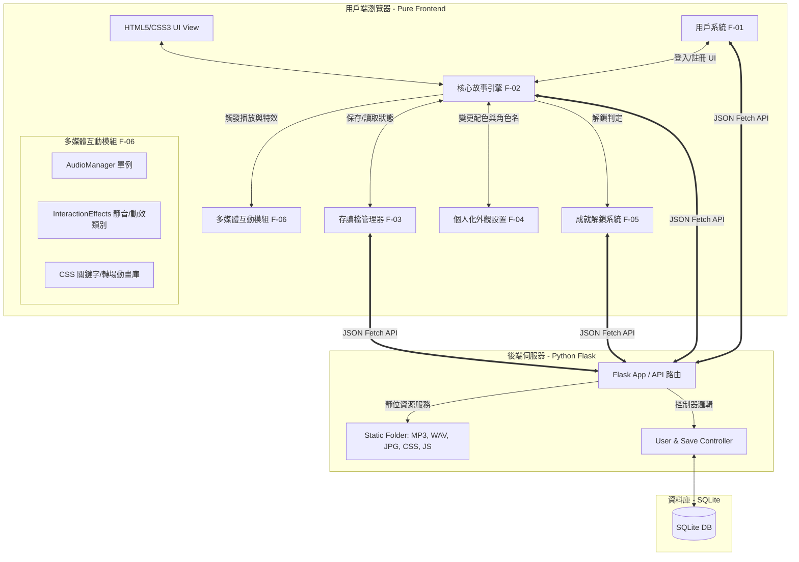
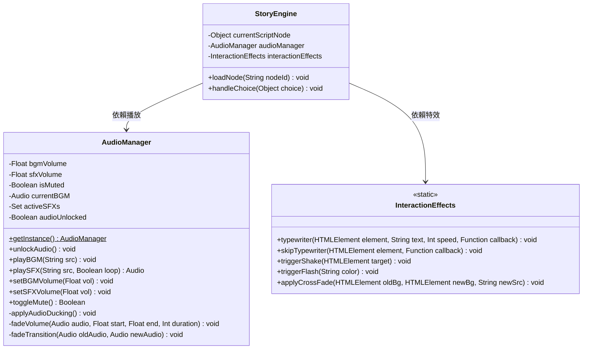
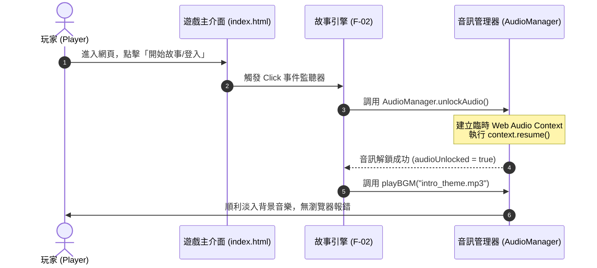
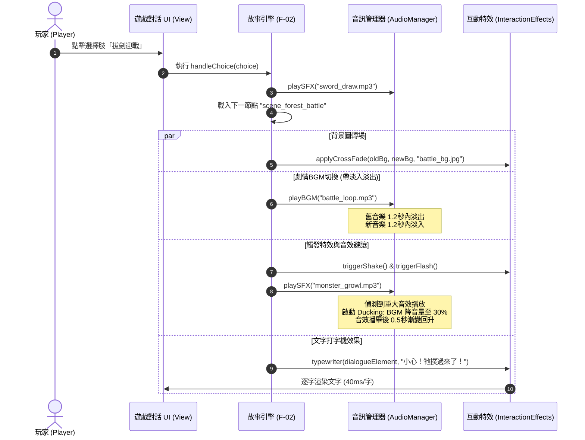
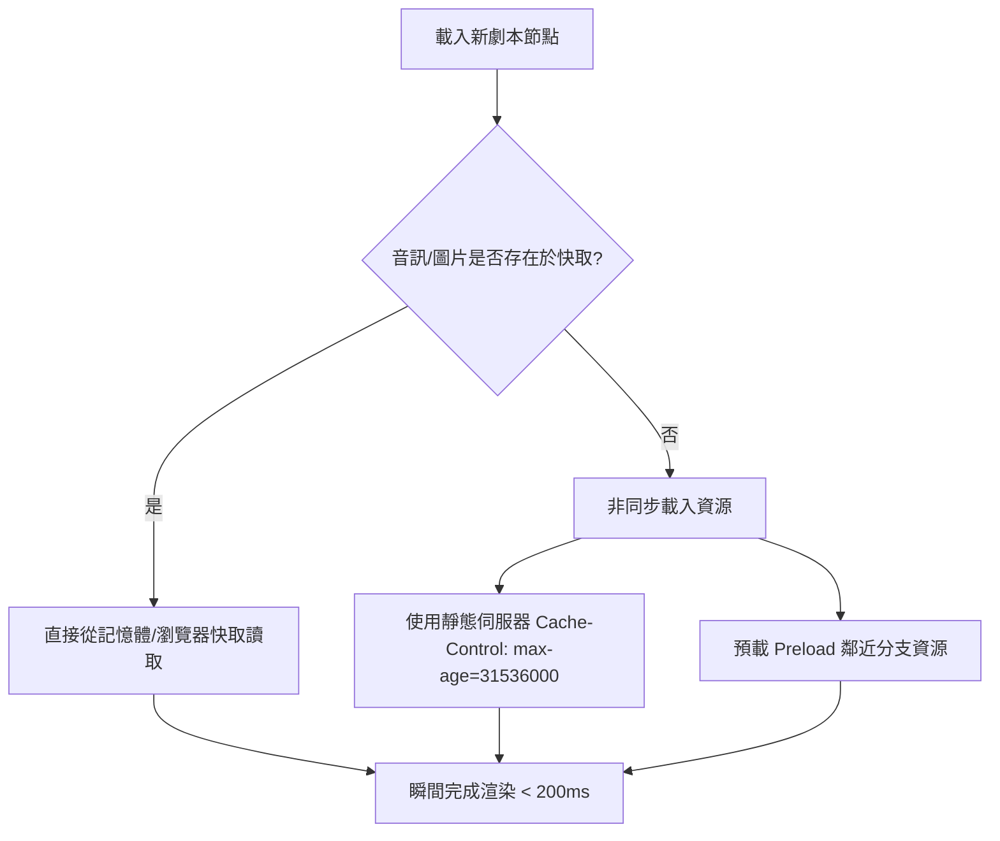

# 戀愛互動式故事網站 - 系統架構文件 (System Architecture Document)

| 專案名稱 | 戀愛互動式故事網站 | 組別 / 組號 | 等一下要吃什麼? / 17 |
| :--- | :--- | :--- | :--- |
| **文件名稱** | 系統架構文件 (Architecture Specification) | **主要依據** | [PRD_Multimedia_Interaction.md](file:///c:/Users/user/OneDrive/%E6%A1%8C%E9%9D%A2/17_What-to-eat--1/docs/PRD_Multimedia_Interaction.md) |
| **文件版本** | V1.0 | **建立日期** | 2026-05-20 |
| **狀態** | 正式 (Finalized) | **適用範圍** | 全組實作、模組對接參考 |

---

## 1. 系統架構概述 (System Architecture Overview)

本專案採用經典的 **前後端分離架構**。配合課堂規範，前端使用純網頁技術（Vanilla HTML5, CSS3, JavaScript ES6），後端使用輕量級 Python Flask 框架，並以 SQLite 作為資料庫存儲。

系統的整體架構如下圖所示，重點呈現 **多媒體互動模組 (F-06)** 如何作為核心故事引擎 (F-02) 的表現層延伸，並與其他功能模組（F-01, F-03, F-04, F-05）交互運作。



---

## 2. 多媒體與互動系統模組設計 (Multimedia & Interaction Component Design)

多媒體互動模組 (F-06) 為確保在無框架環境下的高維護性與低耦合度，採用 **單例模式 (Singleton Pattern)** 管理全域音訊狀態，並將視覺動效封裝為 **靜態工具類別 (Static Utility Class)**。

### 2.1 類別結構圖 (Class Diagram)



### 2.2 核心模式說明
1. **單例模式 (Singleton)**：`AudioManager` 在全站生命週期中僅存在唯一實例。不論使用者在故事中如何跳轉、開啟成就選單或進行存讀檔，背景音樂與音量控制皆維持同一個音訊上下文 (Audio Context)，防止多重背景音樂重疊播放。
2. **靜態工廠與工具類 (Utility)**：`InteractionEffects` 無需保存內部狀態，所有 DOM 操作與 CSS 動畫觸發皆為無狀態 (Stateless) 的靜態函式，輸入目標 DOM 節點即可運作，便於核心故事引擎 (F-02) 隨時調用。

---

## 3. 系統資料流與整合介面 (Data Flow & Integration Schema)

前後端以及跨模組的資料交換，統一採用結構化的 JSON 格式。以下定義多媒體互動模組的核心資料規格：

### 3.1 劇本 JSON 節點資料規格 (由故事引擎 F-02 提供)
每一個劇本節點（Node）皆包含完整的畫面配置與多媒體觸發指令：

```json
{
  "node_id": "scene_forest_01",
  "background_image": "/static/images/bg/forest_night.jpg",
  "speaker": "神秘少女",
  "dialogue": "小心！前面好像有什麼東西在靠近……",
  "bgm": "/static/audio/bgm/tension_loop.mp3",
  "effects": [
    {
      "type": "shake",
      "target": "#game-viewport",
      "delay": 500
    },
    {
      "type": "flash",
      "color": "rgba(255, 0, 0, 0.4)",
      "delay": 600
    },
    {
      "type": "sfx",
      "src": "/static/audio/sfx/monster_growl.mp3",
      "loop": false,
      "delay": 500
    }
  ],
  "choices": [
    {
      "text": "拔劍迎戰",
      "next_node": "scene_forest_battle",
      "sfx_on_hover": "/static/audio/sfx/ui_hover.mp3",
      "sfx_on_click": "/static/audio/sfx/sword_draw.mp3"
    },
    {
      "text": "轉身逃跑",
      "next_node": "scene_forest_run",
      "sfx_on_hover": "/static/audio/sfx/ui_hover.mp3",
      "sfx_on_click": "/static/audio/sfx/footsteps_fast.mp3"
    }
  ]
}
```

### 3.2 存讀檔系統的 JSON 資料規格 (F-03 串接 F-06)
當陳姵羽 (F-03) 進行存讀檔時，必須將多媒體目前的狀態一併序列化存入 SQLite，確保讀檔時音樂與氛圍能完全還原：

```json
{
  "save_id": "save_20260520_001",
  "user_id": 17,
  "current_node": "scene_forest_01",
  "saved_at": "2026-05-20T23:30:55Z",
  "multimedia_state": {
    "current_bgm_src": "/static/audio/bgm/tension_loop.mp3",
    "bgm_playback_position": 42.5,
    "bgm_volume": 0.5,
    "sfx_volume": 0.8,
    "is_muted": false
  },
  "appearance_state": {
    "current_theme": "dark-pink",
    "player_custom_name": "小晴"
  }
}
```

---

## 4. 關鍵循序圖 (Sequence Diagrams)

### 4.1 循序圖一：瀏覽器安全解鎖 (Audio Autoplay Unlock)
現代瀏覽器預防網頁自動播放噪音，必須藉由玩家「點擊」動作來解鎖 Audio Context。



### 4.2 循序圖二：劇本節點載入與多媒體併發渲染
展示當玩家做出選擇後，故事引擎、音訊管理器與視覺特效如何協同運作。



---

## 5. CSS 與視覺表現層架構 (CSS & Presentation Layer)

為配合 **廖奕臻 (F-04 個人化外觀設置)** 的配色與樣式系統，前端互動效果的 CSS 架構遵循以下規範：

1. **樣式隔離**：所有互動效果的 CSS 類別統一加上 `effect-` 或 `interact-` 前綴（例如：`.effect-shake`、`.effect-flash`），避免與全站基本排版樣式衝突。
2. **CSS 變數控制**：利用 CSS Variables 控制動畫參數，方便與外觀設置模組 (F-04) 整合：
   ```css
   :root {
     --transition-speed-fade: 0.8s;
     --interaction-glow-color: rgba(255, 105, 180, 0.4); /* 粉嫩戀愛主題色 */
     --typewriter-font-size: 1.15rem;
   }
   ```
3. **GPU 硬體加速**：涉及畫面震動（`transform: translate`）與淡入淡出（`opacity`）的動畫，一律使用能啟用 GPU 加速的 CSS 屬性，避免造成網頁頁面重排（Reflow），確保在不同配備的手機與電腦上皆能維持 60 FPS 的流暢度。

---

## 6. 性能優化與快取策略 (Performance & Caching)

為了達成非功能性需求中**「轉場與資源載入小於 2 秒」**的嚴格效能指標，架構中引入以下優化方案：



1. **HTTP 長期快取 (Long-term Caching)**：
   在 Flask 後端伺服器，針對 `/static/audio/` 與 `/static/images/` 等靜態資源路由，寫入強大的快取回應標頭：
   ```python
   @app.after_request
   def add_header(response):
       if 'Cache-Control' not in response.headers:
           # 快取保留 1 年
           response.headers['Cache-Control'] = 'public, max-age=31536000'
       return response
   ```
2. **音訊與影像雙重非同步預載**：
   * 當故事推進至 Node A 時，故事引擎 (F-02) 除了解析當前節點，還會預先取出 Node A 之下所有選擇肢（Choices）指向的下一代節點，並調用 `new Audio(nextBgmSrc).preload = "auto"` 與 `new Image().src = nextBgImgSrc`，提前利用瀏覽器閒置頻寬下載資源。

---

## 7. 部署與實作邊界 (Deployment & Constraints)

1. **部署環境**：本系統架構完全相容於 Python Flask 本地端伺服器部署（`python app.py`），資料庫為嵌入式單一檔案 SQLite（`database/story.db`），無須配置複雜的資料庫伺服器。
2. **多媒體路徑規範**：
   * 音效檔存放路徑：`app/static/audio/sfx/`
   * 背景音樂存放路徑：`app/static/audio/bgm/`
   * 背景影像存放路徑：`app/static/images/bg/`
3. **無框架前端邊界限制**：
   * 不得引用額外的前端打包工具（如 Webpack, Vite）。
   * 模組間的通訊統一透過 JavaScript ES6 模組導入 (`import / export`)，在 HTML 中需宣告 `<script type="module" src="app.js"></script>`。

---

*本文件為「等一下要吃什麼? / 17」組別之期末專題系統架構基準，開發實作時若有任何架構變更，需經由全體組員討論並更新此文件。*
